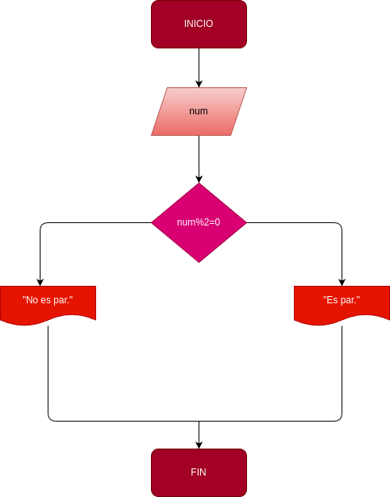

# Par_impar
Programa para verificar si un numero es par o impar

Construir un programa que lea un numero entero y que determine si se trata de un numero par

# Analisis

# input

### Variables de entrada
n: nùmero al que se desea aplicar el programa 
### processing 

si n: n % 2 = 0 se determina que es par

si n : n % 2 = 1 se determina  que es impar 

### output 
respuesta
# Diseño

# Construcciòn 

